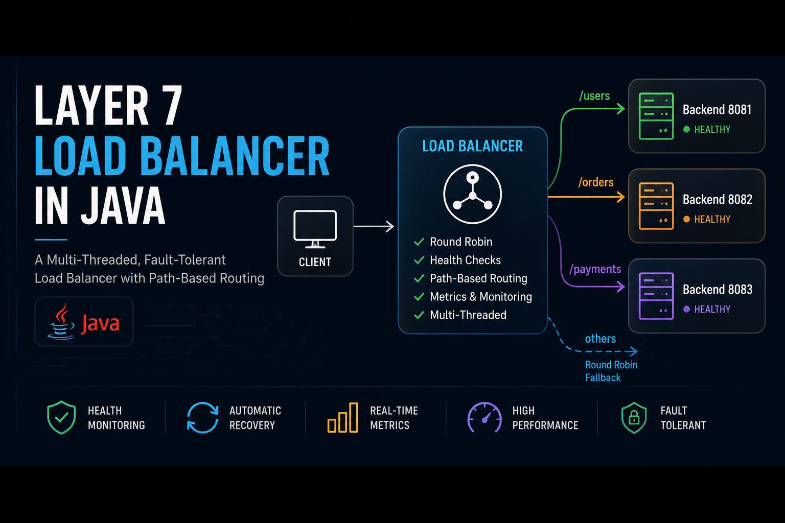

# Layer 7 Load Balancer in Java

<p align="center">
  
</p>

<p align="center">
  <b>Multi-Threaded Layer 7 Load Balancer built using Core Java</b>
</p>

<p align="center">
  Round Robin • Health Checks • Fault Tolerance • Metrics • Path-Based Routing
</p>

<p align="center">
  
  
  
  
</p>

---

## 🚀 Overview

A multi-threaded **Layer 7 Load Balancer** built using **Core Java** to efficiently distribute HTTP requests across multiple backend servers.

The project implements:

- Round Robin Load Balancing
- Multi-Threaded Request Handling
- Health Monitoring
- Automatic Recovery Detection
- Fault Tolerance
- Metrics Collection
- Path-Based Routing
- Concurrent Processing

This project demonstrates important backend engineering and distributed systems concepts commonly used in modern infrastructure systems.

---

## ✨ Features

### 🔄 Round Robin Load Balancing

Distributes incoming requests evenly across backend servers.

Example:

```text
Request 1 → Backend 8081
Request 2 → Backend 8082
Request 3 → Backend 8083
Request 4 → Backend 8081
```

---

### ⚡ Multi-Threaded Request Processing

Uses Java's ExecutorService to handle multiple requests concurrently.

Benefits:

- High throughput
- Improved responsiveness
- Better scalability
- Efficient thread reuse

---

### ❤️ Health Monitoring

Periodically checks backend health using a dedicated Health Checker service.

Health Endpoint:

```http
/health
```

Example:

```text
http://localhost:8081/health
```

Response:

```text
OK
```

---

### 🛡️ Fault Tolerance

If a backend server becomes unavailable:

```text
Backend 8081 ✅
Backend 8082 ❌
Backend 8083 ✅
```

The load balancer automatically removes the failed backend from routing.

---

### 🔁 Automatic Recovery Detection

If a failed backend comes back online:

```text
Backend 8082 ❌ → ✅
```

The health checker automatically detects the recovery and adds it back to the active server pool.

---

### 📊 Metrics Collection

Tracks:

- Total Requests
- Requests Per Backend

Metrics Endpoint:

```http
/metrics
```

Example:

```text
http://localhost:8080/metrics
```

Sample Output:

```text
Total Requests: 120

Requests Per Backend:

http://localhost:8081 -> 40
http://localhost:8082 -> 40
http://localhost:8083 -> 40
```

---

### 🌐 Path-Based Routing (Layer 7)

Routes traffic based on URL paths.

Examples:

```text
/users      -> Backend 8081
/orders     -> Backend 8082
/payments   -> Backend 8083
```

Unknown routes fall back to Round Robin routing.

---

## 🏗️ System Architecture

```text
                    Client
                       │
                       ▼
           ┌─────────────────────┐
           │   Load Balancer     │
           │      Port 8080      │
           └──────────┬──────────┘
                      │
      ┌───────────────┼────────────────┐
      │               │                │
      ▼               ▼                ▼

  /users          /orders        /payments
 Backend 8081   Backend 8082   Backend 8083

                      │
                      ▼

              Round Robin Fallback

       ┌────────────┬────────────┬
       ▼            ▼            ▼

<<<<<<< HEAD
    Backend 8081  Backend 8082  Backend 8083
=======
Backend 8081    Backend 8082   Backend 8083
>>>>>>> 3e8ee127f5beb13e9b0a4eb3aa29dd1b2d9cde3f
```

---

## 🛠️ Tech Stack

- Java 17+
- Core Java
- HttpServer API
- HttpURLConnection
- ExecutorService
- ScheduledExecutorService
- AtomicInteger
- ConcurrentHashMap
- HTTP Networking

---

## 📂 Project Structure

```text
Layer7LoadBalancer/
│
├── assets/
│   └── layer7-load-balancer.png
│
├── BackendServer.java
├── LoadBalancer.java
├── HealthChecker.java
├── MetricsManager.java
├── ServerInfo.java
│
└── README.md
```

---

## ⚙️ Core Components

### BackendServer.java

Responsibilities:

- Creates backend servers
- Handles HTTP requests
- Exposes `/health` endpoint
- Returns processed request information

Endpoints:

```http
/
/health
```

---

### LoadBalancer.java

Responsibilities:

- Accept incoming requests
- Perform path-based routing
- Execute Round Robin distribution
- Forward requests to backend servers
- Track request metrics

---

### ServerInfo.java

Stores:

- Backend URL
- Health Status

Used by:

- LoadBalancer
- HealthChecker

---

### HealthChecker.java

Runs periodically using ScheduledExecutorService.

Responsibilities:

- Checks backend health every 5 seconds
- Marks servers healthy/unhealthy
- Supports automatic recovery

---

### MetricsManager.java

Tracks:

- Total Requests
- Requests Per Backend

Uses:

- AtomicInteger
- ConcurrentHashMap

for thread-safe operations.

---

## 🚀 How To Run

### Step 1: Compile

```bash
javac *.java
```

### Step 2: Start Backend Servers

Terminal 1

```bash
java BackendServer 8081
```

Terminal 2

```bash
java BackendServer 8082
```

Terminal 3

```bash
java BackendServer 8083
```

### Step 3: Start Load Balancer

Terminal 4

```bash
java LoadBalancer
```

Output:

```text
Load Balancer running on port 8080
```

---

## 🧪 API Testing

### Round Robin

```text
http://localhost:8080/test
```

### Path-Based Routing

Users Service

```text
http://localhost:8080/users
```

Orders Service

```text
http://localhost:8080/orders
```

Payments Service

```text
http://localhost:8080/payments
```

### Health Monitoring

```text
http://localhost:8081/health
http://localhost:8082/health
http://localhost:8083/health
```

### Metrics

```text
http://localhost:8080/metrics
```

---

## 📋 Sample Console Output

### Health Checker

```text
http://localhost:8081 -> HEALTHY
http://localhost:8082 -> HEALTHY
http://localhost:8083 -> HEALTHY
------------------------
```

### Request Routing

```text
pool-1-thread-1 -> http://localhost:8081
pool-1-thread-2 -> http://localhost:8082
pool-1-thread-3 -> http://localhost:8083
```

---

## 🧠 Key Concepts Demonstrated

- Layer 7 Load Balancing
- Distributed Systems Fundamentals
- Multi-Threading
- Concurrent Programming
- HTTP Request Routing
- Health Monitoring
- Fault Tolerance
- Automatic Recovery
- Metrics Collection
- Backend Scalability
- Thread Safety
- Performance Optimization

---

## 🔮 Future Enhancements

- Least Connections Load Balancing
- Weighted Round Robin
- Dynamic Backend Registration
- Configuration File Support
- Docker Deployment
- Request Rate Limiting
- Response Time Analytics
- HTTPS Support
- Web Dashboard for Monitoring

---

## 👨‍💻 Author

**Karan Sharma**

Built as a learning project to explore:

- Backend Development
- Distributed Systems
- Networking
- Concurrent Programming
- System Design
